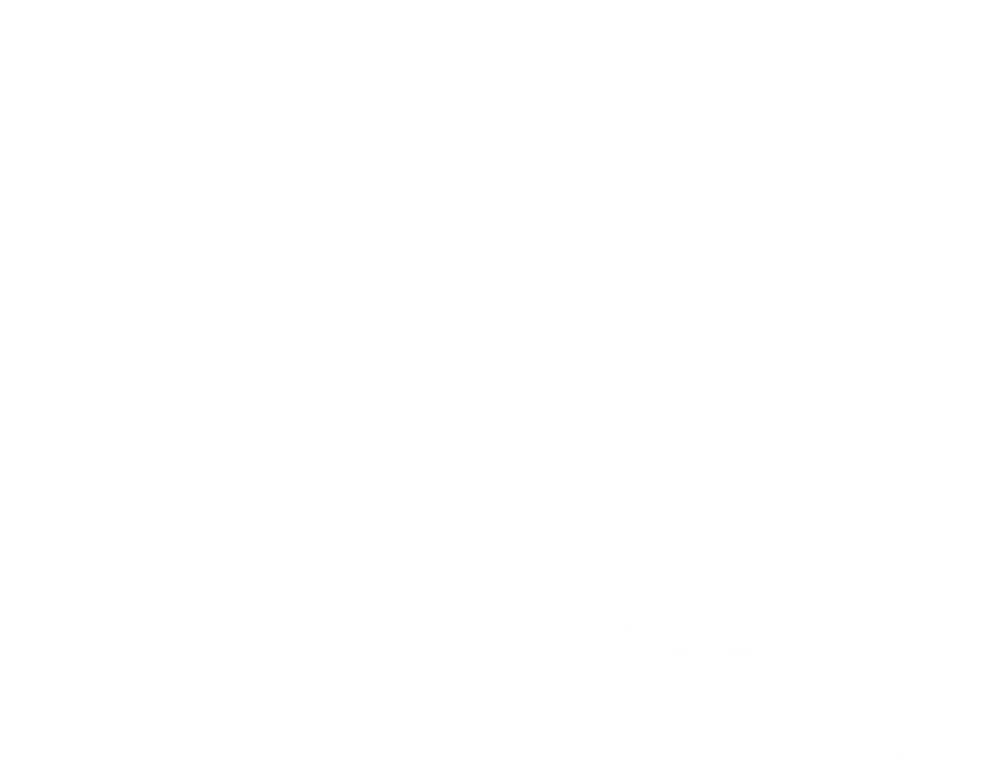
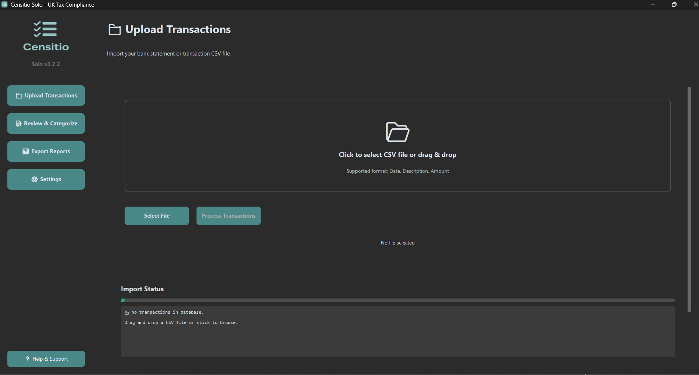
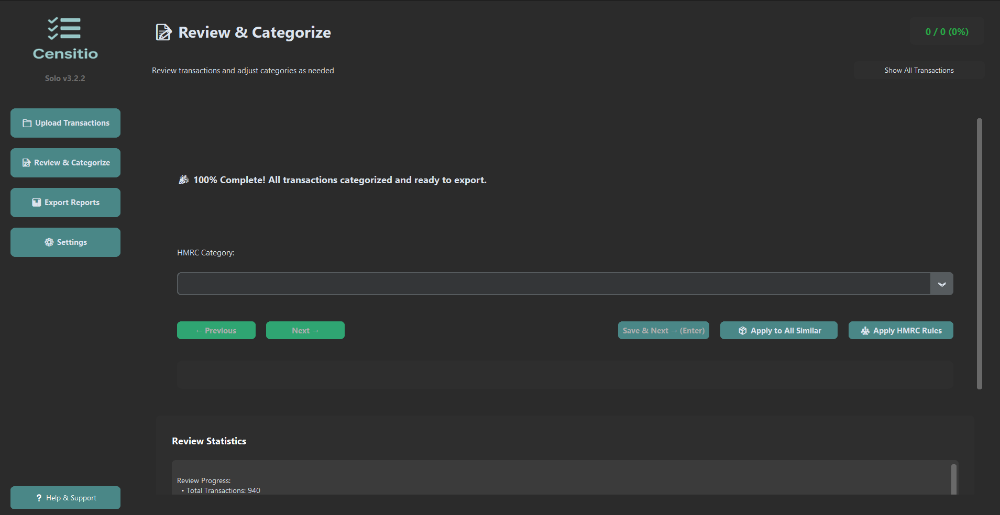
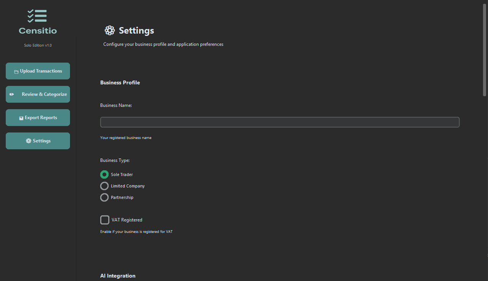
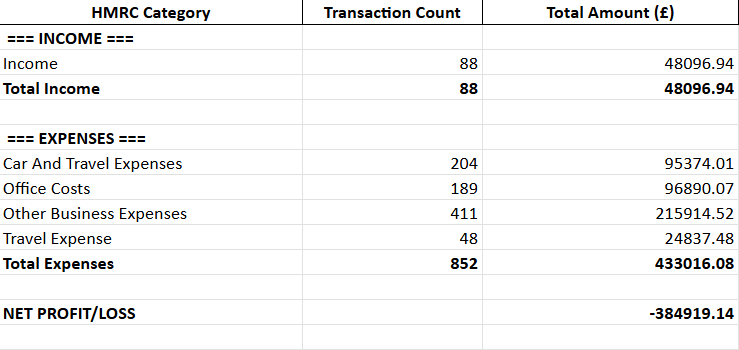

# Censitio Solo — HMRC-Compliant Transaction Manager
<br>
<p align="center">
  
</p>
<br>

> **Professional transaction categorization and HMRC-compliant tax reporting for UK sole traders, freelancers, and micro-businesses.**

Censitio Solo is a desktop application that transforms messy bank statements into organized, HMRC-ready tax reports. Built for UK sole traders who need reliable transaction categorization without the complexity of full accounting software.

---

## 🎯 Key Features

### ✅ **Free Forever Core Features**
- **Bank Statement Import** — CSV and HTML support for all major UK banks
- **Smart Categorization** — 50+ HMRC-compliant categories with rule-based automation
- **Intelligent Learning System** — Gets smarter with every transaction you categorize
- **Manual Review Tools** — Bulk operations, fuzzy search, and keyboard shortcuts
- **Professional Exports** — CSV, Excel, HMRC Summary, and Category Breakdown reports
- **Date Range Filtering** — Focus on specific tax years or accounting periods
- **Merchant Recognition** — Automatic pattern learning from past categorizations
- **Offline-First** — All data stays on your computer, no cloud required

### 🚀 **Coming Soon: Pro Tier**
- **AI-Powered Categorization** — OpenAI integration for instant smart suggestions
- **PDF Export Templates** — Professional reports for accountants and HMRC
- **Business Context Awareness** — Industry-specific VAT rules and category priorities
- **Bulk Export Operations** — Generate multiple reports with one click
- **Priority Support** — Direct email support and feature requests

---

## 📊 What Problem Does Censitio Solve?

**Before Censitio:**
- ❌ Hours spent manually sorting through bank statements
- ❌ Uncertainty about HMRC category classifications
- ❌ Spreadsheet hell with hundreds of rows and formulas
- ❌ Worry about missing deductible expenses
- ❌ Last-minute panic during Self Assessment season

**After Censitio:**
- ✅ Import 1000+ transactions in seconds
- ✅ Auto-categorize with 73.6% accuracy (validated)
- ✅ Review and correct in a clean, intuitive interface
- ✅ Export HMRC-ready reports with one click
- ✅ Confidence in your tax return accuracy

---

## 💡 How It Works

### 1️⃣ **Import Your Transactions**
Drag and drop CSV or HTML bank statements from any UK bank:
- Barclays, HSBC, Lloyds, NatWest, Santander, Metro Bank, Monzo, Revolut, and more
- Handles multiple formats automatically
- Detects and skips duplicate transactions
- Preserves original data with zero loss

### 2️⃣ **Smart Auto-Categorization**
Three-layer categorization system:
1. **Learned Merchants** — Instant categorization from your history (100% accurate)
2. **HMRC Rules Engine** — 200+ merchant patterns for UK businesses
3. **Manual Review** — Quick keyboard-driven corrections

### 3️⃣ **Review & Refine**
Powerful review interface:
- **Bulk Operations** — Categorize multiple transactions at once
- **Fuzzy Search** — Find similar merchants instantly
- **Keyboard Shortcuts** — `↑`/`↓` navigation, `Enter` to save, `Ctrl+S` shortcuts
- **Real-time Validation** — Ensures all categories are HMRC-compliant

### 4️⃣ **Export Tax Reports**
Generate professional reports in seconds:
- **CSV Quick Export** — Basic transaction lists
- **Excel Quick Export** — Formatted spreadsheets with formulas
- **HMRC Summary** — Income/expense breakdown with net profit calculation
- **Category Breakdown** — Multi-sheet workbooks with per-category details

---

## 🖥️ System Requirements

**Operating System:**
- Windows 10 or later (64-bit)
- Windows 11 supported

**Hardware:**
- 2 GB RAM minimum (4 GB recommended)
- 100 MB free disk space
- 1280x720 display resolution or higher

**Dependencies:**
- **None!** Censitio Solo is a standalone executable
- No Python installation required
- No administrator privileges needed
- Portable — run from any folder or USB drive

---

## 📥 Installation & Quick Start

### Option 1: Windows Executable (Recommended)

1. **Download the latest release:**
   - `CensitioSolo_v3.2.2_win64.exe` (61.4 MB) — Standard installer
   - `CensitioSolo_v3.2.2_portable.zip` (102 MB) — Portable version

2. **Run the application:**
   - **Double-click** `CensitioSolo.exe`
   - Windows SmartScreen may show "Unknown Publisher" warning (expected — not code-signed yet)
   - Click **"More info"** → **"Run anyway"**
   - Verify integrity using SHA256 checksums provided below

3. **First-time setup:**
   - No registration required — starts immediately
   - Default "Free" tier with full core features
   - Optional: Configure API key for Pro features (Settings → AI Settings)

---

## 🚦 Quick Start Guide (5 Minutes)

### **Step 1: Import Your First Statement**
1. Open Censitio Solo
2. Click **Upload** in the sidebar
3. Select your bank statement CSV or HTML file
4. Click **"Import Transactions"**
5. Review the import summary

### **Step 2: Auto-Categorize**
1. Navigate to **Review** page
2. Click **"Apply HMRC Rules"** button
3. Watch as 70-80% of transactions categorize automatically
4. The system learns from your corrections

### **Step 3: Review & Correct**
1. Use `↑`/`↓` arrow keys to navigate
2. Click the **Category dropdown** to change
3. Press `Enter` or click **"Save Category"**
4. Repeat for uncategorized transactions

### **Step 4: Export Tax Report**
1. Go to **Export** page
2. Set your date range (e.g., tax year 2025-2026)
3. Click **"Generate HMRC Summary"**
4. Open the Excel file — ready for your accountant!

---

## 📸 Screenshots & Demo

### Main Interface
<p align="center">
  
</p>
*Clean, modern interface with dark mode support*

### Transaction Review Page
<p align="center">
  
</p>
*Bulk categorization with keyboard shortcuts and fuzzy search*

### Full Customization
<p align="center">
  
</p>
*Set features such as business details and date filtering*

### HMRC Summary Export
<p align="center">
  
</p>
*Professional income/expense breakdown with net profit calculation*

### Full Workflow
<p align="center">
  
</p>

---

## 🔒 Security & Privacy

**Your Data Stays Private:**
- ✅ 100% offline — no internet connection required
- ✅ All data stored locally in `%APPDATA%\Censitio`
- ✅ No telemetry or usage tracking
- ✅ No data uploaded to cloud servers
- ✅ SQLite database with local file encryption support (coming soon)

**Code Integrity:**
- SHA256 checksums provided for all downloads
- Source code available for inspection
- Code signing certificate planned for Pro tier launch
- Regular security audits and updates

---

## 📂 File Locations

Censitio Solo stores all data in your Windows user profile:

```
%APPDATA%\Censitio\
├── config/
│   ├── hmrc_categories.json       # Category definitions (read-only)
│   ├── hmrc_rules.json             # Merchant patterns (read-only)
│   ├── user_settings.json          # Your preferences
│   ├── learned_merchants.json      # Learned categorization patterns
│   └── business_profiles.json      # Business context (Pro)
├── data/
│   └── censitio.db                 # Transaction database (SQLite)
├── logs/
│   ├── censitio.log                # Application logs
│   └── censitio_errors.log         # Error logs (for support)
└── exports/
    └── [your exported reports]     # Generated Excel/CSV files
```

**Backup Your Data:**
- Copy entire `%APPDATA%\Censitio` folder to backup
- Export transaction database using **Settings → Database → Export Backup**
- Portable version: All data stored alongside .exe

---

## 🆘 Troubleshooting

### Windows SmartScreen Warning
**Issue:** "Windows protected your PC" message when running .exe
**Solution:**
1. Click **"More info"**
2. Click **"Run anyway"**
3. This is expected — the application is not yet code-signed
4. Verify file integrity with SHA256 checksums below

### Categories Not Loading
**Issue:** Only "Uncategorized" appears in dropdown
**Solution:**
- This was fixed in v3.2.2 (2026-02-10)
- Ensure you're running the latest version
- Check `%APPDATA%\Censitio\config\hmrc_categories.json` exists

### Database Not Persisting
**Issue:** Categories reset after closing application
**Solution:**
- Fixed in v3.2.2 (2026-02-10)
- Check `censitio.db` exists in `%APPDATA%\Censitio\data\`
- Ensure you have write permissions to `%APPDATA%` folder

### Import Errors
**Issue:** CSV file won't import
**Solution:**
1. Check file encoding (UTF-8 recommended)
2. Ensure date format is DD-MM-YYYY or YYYY-MM-DD
3. Check logs at `%APPDATA%\Censitio\logs\censitio_errors.log`
4. Contact support with error log

---

## 📋 Release Notes — v3.2.2 (2026-02-12)

### 🔥 Critical Bug Fixes
- **Database Persistence** — Categories and settings now persist correctly in `.exe` builds
- **Config File Loading** — HMRC categories load properly in PyInstaller frozen builds
- **Excel Export Format** — Fixed "we found a problem with some content" warning
- **Formula Errors** — Fixed `#ERROR! Formula parse error` in HMRC summary section headers

### ✨ New Features
- **HMRC Summary Export** — Professional income/expense breakdown with net profit
- **Category Breakdown Export** — Multi-sheet Excel workbooks with transaction details
- **Date Range Filtering** — Filter exports by specific date ranges (tax years)
- **Version Centralization** — Single source of truth for version display

### 🐛 Bug Fixes
- Export amounts now show as positive (HMRC-compliant)
- Combined filter logic (AND instead of OR)
- Icon consistency across UI
- Version label visibility in dark mode
- Settings page AttributeError for Free tier users

---

## 🔐 File Verification (SHA256 Checksums)

**Verify your download integrity:**

```
CensitioSolo_v3.2.2_win64.exe
SHA256: f2334d0a753a474ec8a15205eb5a92b4109764a53ecd8ba821808fbe50b206a3

CensitioSolo_v3.2.2_portable.zip
SHA256: 674b2450cbd8f00275d52f017b2f8a6fc659c57a73a48eb56fd66573dbf4f590
```

**How to verify on Windows:**
```powershell
Get-FileHash CensitioSolo_v3.2.2_win64.exe -Algorithm SHA256
```

## 💬 Support & Community

**Get Help:**
- 🐛 Report Bugs: support@censitio.co.uk

---

## 📄 License

**Censitio Solo Free Tier** — Free for personal and commercial use
**Censitio Solo Pro** — Annual subscription (coming soon)

Copyright © 2025 Censitio. All rights reserved.

---

## 🙏 Acknowledgments

Built with:
- [CustomTkinter](https://github.com/TomSchimansky/CustomTkinter) — Modern UI framework
- [Pandas](https://pandas.pydata.org/) — Data processing
- [OpenPyXL](https://openpyxl.readthedocs.io/) — Excel export
- [ReportLab](https://www.reportlab.com/) — PDF generation (Pro)
- [SQLite](https://www.sqlite.org/) — Local database

Special thanks to UK HMRC for providing clear business expense guidance.

---

## ⭐ Show Your Support

If Censitio Solo saves you time during tax season:
- ⭐ **Star this repository** to help others discover it
- 🐛 **Report bugs** to help us improve
- 💡 **Request features** you'd find useful
- 📢 **Tell other sole traders** who might benefit

---

**Made with ☕ in the UK for UK businesses**

[Download Latest Release](https://github.com/Censitio/app/releases)
